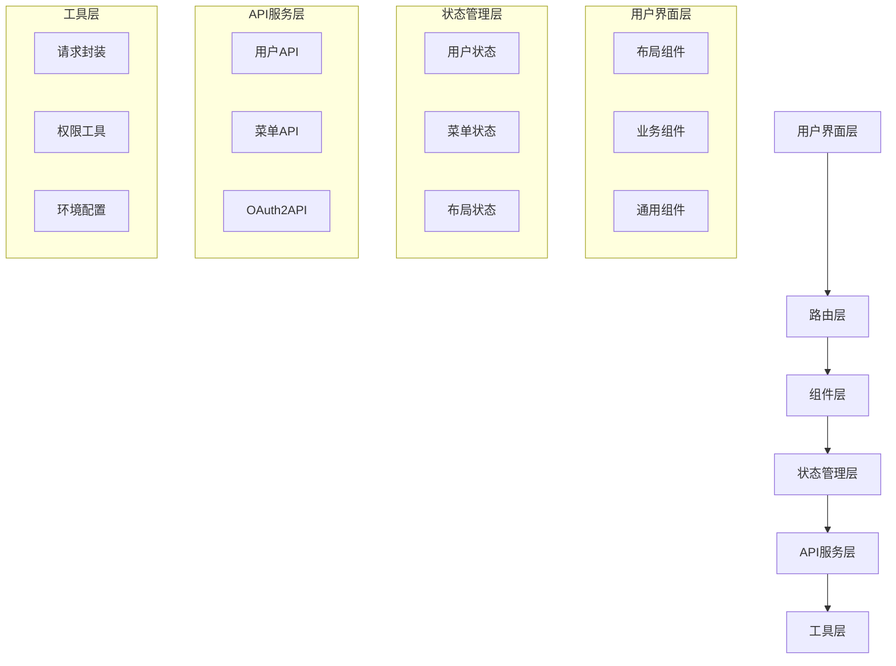
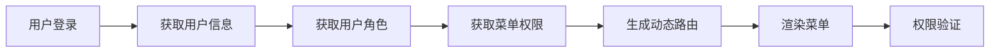
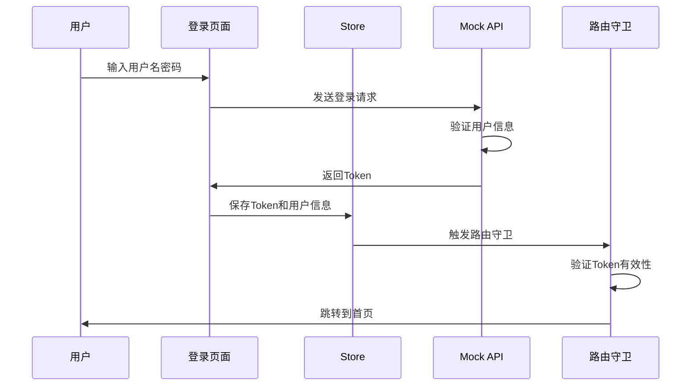
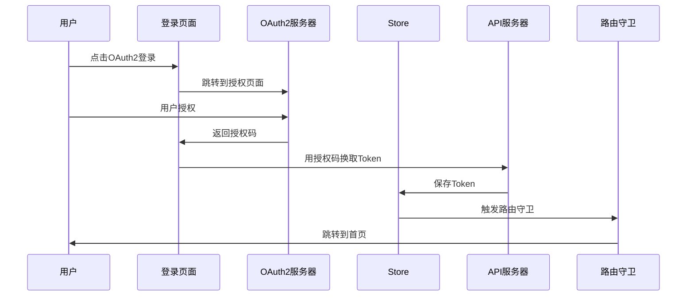

# KBPD Admin 系统设计与开发指南

> **知识库后台管理系统完整设计文档**  
> 包含系统架构、功能说明、开发指南、扩展接入及数据对接方案

## 📋 目录

- [系统概述](#系统概述)
- [技术架构](#技术架构)
- [核心功能模块](#核心功能模块)
- [认证与权限系统](#认证与权限系统)
- [数据模式对接](#数据模式对接)
- [布局系统](#布局系统)
- [开发指南](#开发指南)
- [扩展接入](#扩展接入)
- [部署与配置](#部署与配置)
- [最佳实践](#最佳实践)

---

## 🎯 系统概述

### 项目基本信息

- **项目名称**: KBPD Admin (Knowledge Base Platform Dashboard)
- **项目版本**: 1.0.0
- **技术栈**: Vue 3 + TypeScript + Pinia + Element Plus + Vite
- **设计理念**: 模块化、可配置、响应式、多模式支持

### 核心特性

✅ **双模式认证**：支持Mock开发模式和OAuth2生产模式  
✅ **权限管理**：基于角色的菜单权限和按钮权限控制  
✅ **响应式布局**：适配桌面端、平板端、移动端  
✅ **主题系统**：支持明暗主题切换和自定义主题色  
✅ **标签页管理**：智能标签页缓存和右键菜单操作  
✅ **模块化设计**：高度可扩展的组件化架构

---

## 🏗️ 技术架构

### 架构图



### 技术选型说明

| 技术         | 版本    | 作用       | 选择理由                        |
| ------------ | ------- | ---------- | ------------------------------- |
| Vue 3        | ^3.5.13 | 前端框架   | 组合式API、更好的TypeScript支持 |
| TypeScript   | ~5.8.3  | 类型系统   | 提供类型安全，减少运行时错误    |
| Pinia        | ^3.0.3  | 状态管理   | Vue 3官方推荐，更轻量级         |
| Element Plus | ^2.9.10 | UI组件库   | 成熟的企业级UI组件              |
| Vite         | ^6.3.5  | 构建工具   | 快速的开发体验和构建速度        |
| Vue Router   | ^4.5.1  | 路由管理   | Vue 3配套路由系统               |
| Axios        | ^1.9.0  | HTTP客户端 | 功能强大的请求库                |

### 项目结构

```
src/
├── api/                    # API接口层
│   └── sys/               # 系统模块API
│       ├── user/          # 用户相关接口
│       └── menu/          # 菜单相关接口
├── components/            # 通用组件
│   ├── SvgIcon/          # SVG图标组件
│   └── index.ts          # 组件导出
├── config/               # 配置文件
│   └── index.ts          # 应用配置
├── layout/               # 布局系统
│   ├── components/       # 布局组件
│   ├── hooks/           # 布局钩子函数
│   ├── styles/          # 布局样式
│   └── types.ts         # 布局类型定义
├── router/              # 路由配置
│   ├── index.ts         # 路由实例
│   ├── routes.ts        # 路由配置
│   └── dynamicRoutes.ts # 动态路由
├── store/               # 状态管理
│   ├── user.ts          # 用户状态
│   └── menu.ts          # 菜单状态
├── styles/              # 全局样式
├── utils/               # 工具函数
│   ├── request.ts       # 请求封装
│   ├── env.ts           # 环境配置
│   ├── errorHandler.ts  # 错误处理
│   └── routePermission.ts # 路由权限
├── views/               # 页面组件
│   ├── login/           # 登录页面
│   ├── home/            # 首页
│   ├── system/          # 系统管理
│   ├── content/         # 内容管理
│   └── 404/             # 404页面
├── App.vue              # 根组件
├── main.ts              # 应用入口
└── vite-env.d.ts        # 类型声明
```

---

## 🔧 核心功能模块

### 1. 用户认证模块

#### 功能特性

- **双模式登录**：Mock模式（开发）+ OAuth2模式（生产）
- **Token管理**：自动存储、刷新、过期处理
- **安全防护**：CSRF防护、状态验证、XSS防护

#### 核心文件

- `src/store/user.ts` - 用户状态管理
- `src/api/sys/user/index.ts` - 用户API接口
- `src/views/login/index.vue` - 登录页面
- `src/utils/request.ts` - 请求拦截器

### 2. 权限管理模块

#### 权限层级

1. **路由权限**：控制页面访问
2. **菜单权限**：控制菜单显示
3. **按钮权限**：控制操作按钮
4. **数据权限**：控制数据范围（扩展）

#### 权限控制流程



### 3. 布局系统模块

#### 布局模式

- **垂直布局**：侧边栏 + 主内容区（默认）
- **水平布局**：顶部导航 + 主内容区
- **混合布局**：顶级菜单（顶部）+ 子菜单（侧边）

#### 核心组件

- `src/layout/index.vue` - 主布局容器
- `src/layout/components/lay-sidebar/` - 侧边栏组件
- `src/layout/components/lay-navbar/` - 导航栏组件
- `src/layout/components/lay-tag/` - 标签页组件

### 4. 标签页管理模块

#### 功能特性

- **智能缓存**：基于路由的页面缓存
- **右键菜单**：关闭、刷新、关闭其他等操作
- **持久化存储**：标签页状态本地保存
- **响应式设计**：移动端适配

#### 核心实现

- `src/layout/hooks/useTag.ts` - 标签页逻辑
- `src/layout/components/lay-tag/index.vue` - 标签页UI

---

## 🔐 认证与权限系统

### 认证流程设计

#### Mock模式认证流程



#### OAuth2模式认证流程



### 权限验证机制

#### 路由权限验证

```typescript
// src/router/index.ts
router.beforeEach(async (to, from, next) => {
  const userStore = useUserStore();

  // 检查是否需要登录
  if (to.meta.requiresAuth && !userStore.isLoggedIn) {
    next("/login");
    return;
  }

  // 检查角色权限
  if (to.meta.roles && !hasRole(to.meta.roles)) {
    next("/403");
    return;
  }

  next();
});
```

#### 按钮权限验证

```typescript
// 权限指令
app.directive("permission", {
  mounted(el, binding) {
    const { value } = binding;
    const userPermissions = useUserStore().permissions;

    if (!userPermissions.includes(value)) {
      el.style.display = "none";
    }
  }
});
```

---

## 📊 数据模式对接

### Mock数据模式（开发环境）

#### 配置方式

```bash
# .env.dev
VITE_LOGIN_MODE=mock
VITE_ENABLE_MOCK=true
```

#### Mock数据结构

```typescript
// mock/user.ts
interface MockUser {
  userId: number;
  username: string;
  password: string;
  avatar: string;
  roles: string[];
  buttons: string[]; // 按钮权限
  routes: string[]; // 路由权限
  token: string;
  // 扩展字段
  email?: string;
  phone?: string;
  realName?: string;
  department?: string;
}

// 示例数据
const mockUsers = [
  {
    userId: 1,
    username: "admin",
    password: "111111",
    avatar: "https://example.com/avatar.jpg",
    roles: ["平台管理员", "系统管理员"],
    buttons: ["system.user", "system.role", "system.menu"],
    routes: ["home", "system", "content"],
    token: "Admin Token"
  }
];
```

#### Mock菜单数据结构

```typescript
interface MockMenu {
  id: string;
  parentId?: string;
  path: string;
  name: string;
  meta: {
    title: string;
    icon?: string;
    roles?: string[]; // 角色权限
    permission?: string; // 按钮权限
    keepAlive?: boolean;
    hidden?: boolean;
  };
  children?: MockMenu[];
}
```

### OAuth2数据模式（生产环境）

#### 配置方式

```bash
# .env.prod
VITE_LOGIN_MODE=oauth2
VITE_OAUTH2_AUTH_URL=https://oauth2-server.com/oauth2/authorize
VITE_OAUTH2_TOKEN_URL=https://oauth2-server.com/oauth2/token
VITE_OAUTH2_CLIENT_ID=your-client-id
VITE_OAUTH2_REDIRECT_URI=https://your-domain.com/auth/callback
```

#### OAuth2数据接口规范

**1. 获取访问令牌**

```typescript
// 请求
POST /oauth2/token
Content-Type: application/x-www-form-urlencoded

{
  grant_type: "authorization_code",
  client_id: "your-client-id",
  code: "authorization-code",
  redirect_uri: "callback-url"
}

// 响应
{
  access_token: "eyJhbGciOiJIUzI1NiIs...",
  refresh_token: "eyJhbGciOiJIUzI1NiIs...",
  token_type: "Bearer",
  expires_in: 3600
}
```

**2. 获取用户信息**

```typescript
// 请求
GET /user/info
Authorization: Bearer {access_token}

// 响应（需要与Mock数据结构保持一致）
{
  code: 200,
  data: {
    checkUser: {
      userId: 1,
      username: "admin",
      avatar: "https://example.com/avatar.jpg",
      roles: ["平台管理员"],
      buttons: ["system.user", "system.role"],
      routes: ["home", "system"]
    }
  }
}
```

**3. 获取菜单权限**

```typescript
// 请求
GET /menu/list
Authorization: Bearer {access_token}

// 响应（需要与Mock菜单结构保持一致）
{
  code: 200,
  data: [
    {
      id: "system",
      path: "/system",
      name: "System",
      meta: {
        title: "系统管理",
        icon: "Setting",
        roles: ["平台管理员"]
      },
      children: [...]
    }
  ]
}
```

### 数据对接适配器

#### 统一数据格式转换

```typescript
// src/utils/dataAdapter.ts
export class DataAdapter {
  // 用户信息适配
  static adaptUserInfo(data: any): UserInfo {
    if (isMockLogin()) {
      // Mock数据直接使用
      return data.checkUser;
    } else {
      // OAuth2数据转换
      return {
        userId: data.user.id,
        username: data.user.username,
        avatar: data.user.avatar || CONSTANTS.DEFAULT_AVATAR,
        roles: data.user.roles || [],
        buttons: data.permissions || [],
        routes: data.routes || []
      };
    }
  }

  // 菜单数据适配
  static adaptMenuData(data: any): MenuData[] {
    if (isMockLogin()) {
      return data;
    } else {
      // 根据后端API格式进行转换
      return data.map(menu => ({
        id: menu.menuId,
        path: menu.menuPath,
        name: menu.menuName,
        meta: {
          title: menu.menuTitle,
          icon: menu.menuIcon,
          roles: menu.roles,
          permission: menu.permission
        },
        children: menu.children ? this.adaptMenuData(menu.children) : []
      }));
    }
  }
}
```

---

## 🎨 布局系统

### 布局配置系统

#### 配置文件结构

```typescript
// src/config/index.ts
interface LayoutConfig {
  mode: "vertical" | "horizontal" | "mix";
  theme: {
    style: "light" | "dark" | "system";
    primaryColor: string;
    grayMode: boolean;
    weakMode: boolean;
  };
  features: {
    fixedHeader: boolean;
    showTabs: boolean;
    showFooter: boolean;
    keepAlive: boolean;
    multiTagsCache: boolean;
    stretch: boolean;
  };
  sidebar: {
    collapsed: boolean;
    width: number;
    collapsedWidth: number;
  };
}
```

#### 响应式断点设计

```scss
// 响应式断点
$mobile: 768px;
$tablet: 1024px;
$desktop: 1200px;

// 媒体查询混入
@mixin mobile {
  @media (max-width: #{$mobile - 1px}) {
    @content;
  }
}

@mixin tablet {
  @media (min-width: #{$mobile}) and (max-width: #{$tablet - 1px}) {
    @content;
  }
}

@mixin desktop {
  @media (min-width: #{$desktop}) {
    @content;
  }
}
```

### 主题系统

#### CSS变量定义

```scss
// 明亮主题
:root[data-theme="light"] {
  --primary-color: #409eff;
  --bg-color: #ffffff;
  --text-color: #303133;
  --border-color: #dcdfe6;
}

// 暗黑主题
:root[data-theme="dark"] {
  --primary-color: #409eff;
  --bg-color: #1a1a1a;
  --text-color: #e5eaf3;
  --border-color: #414243;
}
```

#### 主题切换逻辑

```typescript
// src/layout/hooks/useDataThemeChange.ts
export function useDataThemeChange() {
  const changeTheme = (theme: string) => {
    document.documentElement.setAttribute("data-theme", theme);

    // 更新Element Plus主题
    const root = document.documentElement;
    root.style.setProperty("--el-color-primary", getPrimaryColor(theme));
  };

  return { changeTheme };
}
```

---

## 💻 开发指南

### 环境准备

#### 系统要求

- Node.js >= 16.0.0
- pnpm >= 7.0.0 (推荐) 或 npm >= 8.0.0

#### 安装依赖

```bash
# 克隆项目
git clone <repository-url>
cd kbpd-admin

# 安装依赖
pnpm install
```

#### 环境配置

```bash
# 开发环境
cp .env.dev .env.development

# 生产环境
cp .env.prod .env.production
```

### 开发流程

#### 1. 启动开发服务器

```bash
# 开发模式（Mock数据）
npm run dev

# 修改登录模式为OAuth2
# 编辑 .env.dev 文件，设置 VITE_LOGIN_MODE=oauth2
```

#### 2. 代码规范

```bash
# ESLint检查
npm run lint

# 自动修复
npm run fix

# 代码格式化
npm run format
```

#### 3. 构建部署

```bash
# 开发环境构建
npm run build:dev

# 生产环境构建
npm run build:prod

# 预览构建结果
npm run preview
```

### 新增页面开发

#### 1. 创建页面组件

```vue
<!-- src/views/example/index.vue -->
<template>
  <div class="example-container">
    <h1>{{ pageTitle }}</h1>
    <!-- 页面内容 -->
  </div>
</template>

<script setup lang="ts">
import { ref } from "vue";

// 页面标题
const pageTitle = ref("示例页面");

// 页面逻辑
</script>

<style lang="scss" scoped>
.example-container {
  padding: 20px;
}
</style>
```

#### 2. 配置路由

```typescript
// src/router/routes.ts
{
  path: '/example',
  name: 'Example',
  component: () => import('@/views/example/index.vue'),
  meta: {
    title: '示例页面',
    icon: 'Document',
    requiresAuth: true,
    roles: ['admin'], // 可选：角色权限
    keepAlive: true   // 可选：页面缓存
  }
}
```

#### 3. 添加菜单项

```typescript
// mock/user.ts (Mock模式)
// 或者在后端API中配置
{
  id: 'example',
  path: '/example',
  name: 'Example',
  meta: {
    title: '示例页面',
    icon: 'Document',
    roles: ['admin']
  }
}
```

### API接口开发

#### 1. 定义类型

```typescript
// src/api/example/type.ts
export interface ExampleReq {
  name: string;
  type: number;
}

export interface ExampleResp {
  code: number;
  data: {
    id: number;
    name: string;
    createdAt: string;
  }[];
  message: string;
}
```

#### 2. 创建API接口

```typescript
// src/api/example/index.ts
import request from "@/utils/request";
import type { ExampleReq, ExampleResp } from "./type";

enum API {
  EXAMPLE_LIST = "/example/list",
  EXAMPLE_CREATE = "/example/create",
  EXAMPLE_UPDATE = "/example/update",
  EXAMPLE_DELETE = "/example/delete"
}

export const getExampleList = () =>
  request.get<void, ExampleResp>(API.EXAMPLE_LIST);

export const createExample = (data: ExampleReq) =>
  request.post<ExampleReq, ExampleResp>(API.EXAMPLE_CREATE, data);
```

#### 3. 页面中使用

```typescript
// 在组件中使用
import { getExampleList } from "@/api/example";

const fetchData = async () => {
  try {
    const result = await getExampleList();
    if (result.code === 200) {
      // 处理成功响应
      console.log(result.data);
    }
  } catch (error) {
    // 处理错误
    console.error(error);
  }
};
```

---

## 🔌 扩展接入

### 组件扩展

#### 1. 创建自定义组件

```vue
<!-- src/components/CustomTable/index.vue -->
<template>
  <div class="custom-table">
    <el-table :data="data" v-bind="$attrs">
      <slot></slot>
    </el-table>
  </div>
</template>

<script setup lang="ts">
interface Props {
  data: any[];
}

defineProps<Props>();
defineOptions({
  name: "CustomTable",
  inheritAttrs: false
});
</script>
```

#### 2. 注册全局组件

```typescript
// src/components/index.ts
import CustomTable from "./CustomTable/index.vue";

export { CustomTable };

// main.ts中注册
import { CustomTable } from "@/components";
app.component("CustomTable", CustomTable);
```

### 布局组件扩展

#### 1. 新增布局模式

```typescript
// src/layout/types.ts
export type LayoutMode = 'vertical' | 'horizontal' | 'mix' | 'custom';

// src/layout/components/NavCustom.vue
<template>
  <div class="nav-custom">
    <!-- 自定义布局实现 -->
  </div>
</template>
```

#### 2. 添加导航栏功能

```vue
<!-- src/layout/components/lay-navbar/CustomFeature.vue -->
<template>
  <div class="custom-feature">
    <!-- 自定义功能 -->
  </div>
</template>
```

### Hook 函数扩展

#### 1. 创建自定义Hook

```typescript
// src/hooks/useCustomFeature.ts
import { ref, computed } from "vue";

export function useCustomFeature() {
  const state = ref(false);
  const loading = ref(false);

  const toggle = async () => {
    loading.value = true;
    try {
      state.value = !state.value;
      // 业务逻辑
    } finally {
      loading.value = false;
    }
  };

  return {
    state: readonly(state),
    loading: readonly(loading),
    toggle
  };
}
```

#### 2. 在组件中使用

```vue
<script setup lang="ts">
import { useCustomFeature } from "@/hooks/useCustomFeature";

const { state, loading, toggle } = useCustomFeature();
</script>
```

### 插件系统扩展

#### 1. 创建Vite插件

```typescript
// plugins/custom-plugin.ts
import type { Plugin } from "vite";

export function customPlugin(): Plugin {
  return {
    name: "custom-plugin",
    configResolved(config) {
      // 插件逻辑
    }
  };
}
```

#### 2. 配置插件

```typescript
// vite.config.ts
import { customPlugin } from "./plugins/custom-plugin";

export default defineConfig({
  plugins: [vue(), customPlugin()]
});
```

---

## 🚀 部署与配置

### 环境配置管理

#### 开发环境配置

```bash
# .env.dev
NODE_ENV=development
VITE_APP_BASE_API=/api
VITE_LOGIN_MODE=mock
VITE_ENABLE_MOCK=true

# OAuth2配置（开发环境测试）
VITE_OAUTH2_AUTH_URL=https://dev-oauth2-server.com/oauth2/authorize
VITE_OAUTH2_TOKEN_URL=https://dev-oauth2-server.com/oauth2/token
VITE_OAUTH2_CLIENT_ID=dev-client-id
VITE_OAUTH2_REDIRECT_URI=http://localhost:5173/auth/callback
```

#### 生产环境配置

```bash
# .env.prod
NODE_ENV=production
VITE_APP_BASE_API=https://api.yourcompany.com/api
VITE_LOGIN_MODE=oauth2
VITE_ENABLE_MOCK=false

# OAuth2生产配置
VITE_OAUTH2_AUTH_URL=https://oauth2.yourcompany.com/oauth2/authorize
VITE_OAUTH2_TOKEN_URL=https://oauth2.yourcompany.com/oauth2/token
VITE_OAUTH2_CLIENT_ID=prod-client-id
VITE_OAUTH2_REDIRECT_URI=https://admin.yourcompany.com/auth/callback
```

### Docker部署

#### Dockerfile

```dockerfile
# 构建阶段
FROM node:18-alpine as builder
WORKDIR /app
COPY package*.json ./
RUN npm ci --only=production
COPY . .
RUN npm run build:prod

# 生产阶段
FROM nginx:alpine
COPY --from=builder /app/dist /usr/share/nginx/html
COPY nginx.conf /etc/nginx/conf.d/default.conf
EXPOSE 80
CMD ["nginx", "-g", "daemon off;"]
```

#### Nginx配置

```nginx
server {
    listen 80;
    server_name localhost;

    location / {
        root /usr/share/nginx/html;
        index index.html index.htm;
        try_files $uri $uri/ /index.html;
    }

    # API代理
    location /api {
        proxy_pass http://backend-service:8080;
        proxy_set_header Host $host;
        proxy_set_header X-Real-IP $remote_addr;
    }
}
```

### CI/CD流水线

#### GitHub Actions示例

```yaml
# .github/workflows/deploy.yml
name: Deploy

on:
  push:
    branches: [main]

jobs:
  build-and-deploy:
    runs-on: ubuntu-latest

    steps:
      - uses: actions/checkout@v3

      - name: Setup Node.js
        uses: actions/setup-node@v3
        with:
          node-version: "18"
          cache: "pnpm"

      - name: Install dependencies
        run: pnpm install

      - name: Build
        run: pnpm run build:prod
        env:
          VITE_LOGIN_MODE: oauth2
          VITE_APP_BASE_API: ${{ secrets.API_BASE_URL }}

      - name: Deploy
        run: |
          # 部署脚本
```

---

## 🎯 最佳实践

### 代码规范

#### 1. 组件命名规范

```typescript
// ✅ 正确：使用PascalCase
const UserList = defineComponent({...});

// ❌ 错误：使用camelCase
const userList = defineComponent({...});
```

#### 2. 文件命名规范

```
// ✅ 正确
src/
├── components/
│   └── UserList/
│       ├── index.vue
│       └── types.ts
├── views/
│   └── user/
│       └── list.vue
└── api/
    └── user/
        ├── index.ts
        └── type.ts
```

#### 3. 类型定义规范

```typescript
// ✅ 正确：明确的类型定义
interface UserInfo {
  id: number;
  username: string;
  email: string;
  roles: string[];
}

// ❌ 错误：使用any类型
interface UserInfo {
  [key: string]: any;
}
```

### 性能优化

#### 1. 路由懒加载

```typescript
// ✅ 正确：使用动态导入
const routes = [
  {
    path: "/user",
    component: () => import("@/views/user/index.vue")
  }
];
```

#### 2. 组件缓存

```vue
<!-- ✅ 正确：使用keep-alive -->
<router-view v-slot="{ Component }">
  <keep-alive :include="cacheList">
    <component :is="Component" />
  </keep-alive>
</router-view>
```

#### 3. 图片优化

```typescript
// ✅ 正确：使用WebP格式和懒加载
<el-image
  :src="imageUrl"
  lazy
  fit="cover"
  :preview-src-list="[imageUrl]"
/>
```

### 安全注意事项

#### 1. XSS防护

```vue
<!-- ✅ 正确：避免v-html -->
<div>{{ userInput }}</div>

<!-- ❌ 危险：使用v-html -->
<div v-html="userInput"></div>
```

#### 2. CSRF防护

```typescript
// ✅ 正确：使用state参数
export const generateState = () => {
  return (
    Math.random().toString(36).substring(2, 15) +
    Math.random().toString(36).substring(2, 15)
  );
};
```

#### 3. 敏感信息保护

```typescript
// ✅ 正确：不在前端存储敏感信息
const token = localStorage.getItem("token"); // 只存储token

// ❌ 错误：存储密码等敏感信息
const password = localStorage.getItem("password");
```

---

## 📚 常见问题与解决方案

### 1. OAuth2认证问题

**问题**：OAuth2回调后无法获取用户信息

**解决方案**：

```typescript
// 检查回调处理逻辑
const handleOAuth2Callback = async () => {
  const urlParams = new URLSearchParams(window.location.search);
  const code = urlParams.get("code");
  const state = urlParams.get("state");

  // 验证state参数
  const savedState = sessionStorage.getItem("oauth2-state");
  if (state !== savedState) {
    throw new Error("Invalid state parameter");
  }

  // 使用code换取token
  await userStore.oAuth2Login({ code, state });
};
```

### 2. 路由权限问题

**问题**：用户刷新页面后权限丢失

**解决方案**：

```typescript
// 在路由守卫中恢复用户状态
router.beforeEach(async (to, from, next) => {
  const userStore = useUserStore();

  // 如果有token但没有用户信息，重新获取
  if (userStore.token && !userStore.userInfo) {
    try {
      await userStore.fetchUserInfo();
    } catch (error) {
      userStore.logout();
      next("/login");
      return;
    }
  }

  next();
});
```

### 3. 标签页重复问题

**问题**：页面刷新后出现重复标签页

**解决方案**：

```typescript
// 使用清理函数
const cleanDuplicateTags = () => {
  const uniqueTags = new Map();

  tagsList.value.forEach(tag => {
    const key = tag.path;
    if (!uniqueTags.has(key) || tag.affix) {
      uniqueTags.set(key, tag);
    }
  });

  tagsList.value = Array.from(uniqueTags.values());
  saveTagsToStorage();
};
```

---

## 📖 版本更新记录

### v1.0.0 (当前版本)

- ✅ 完成基础架构搭建
- ✅ 实现双模式认证系统
- ✅ 完成权限管理模块
- ✅ 实现响应式布局系统
- ✅ 完成标签页管理功能
- ✅ 集成主题系统

### 计划中的功能

- 🔄 国际化支持 (v1.1.0)
- 🔄 数据可视化组件 (v1.2.0)
- 🔄 微前端架构支持 (v2.0.0)
- 🔄 PWA离线支持 (v2.1.0)

---

## 🤝 贡献指南

### 开发规范

1. 遵循Vue 3 Composition API规范
2. 使用TypeScript进行类型约束
3. 遵循ESLint和Prettier代码规范
4. 提交代码前运行测试和代码检查

### 提交规范

```bash
# 功能开发
git commit -m "feat: 添加用户管理功能"

# 问题修复
git commit -m "fix: 修复登录状态丢失问题"

# 文档更新
git commit -m "docs: 更新API文档"
```

### 代码审查清单

- [ ] 类型定义完整
- [ ] 错误处理完善
- [ ] 性能考虑充分
- [ ] 安全措施到位
- [ ] 测试覆盖充分
- [ ] 文档更新及时

---

## 📞 技术支持

如有技术问题或建议，请通过以下方式联系：

- 📧 **邮箱**：tech-support@yourcompany.com
- 💬 **论坛**：https://forum.yourcompany.com
- 📱 **微信群**：扫描二维码加入技术交流群
- 🐛 **问题反馈**：GitHub Issues

---

_最后更新时间：2024年9月23日_  
_文档版本：v1.0.0_

> 本文档涵盖了KBPD Admin系统的完整设计思路、技术实现和扩展指南。如需更详细的技术支持，请参考各个模块的专项文档或联系技术支持团队。
