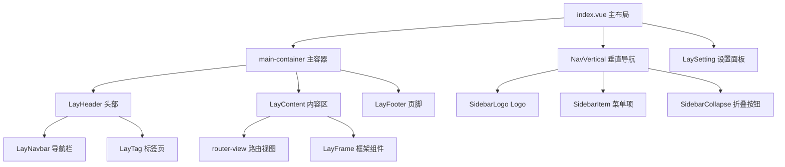
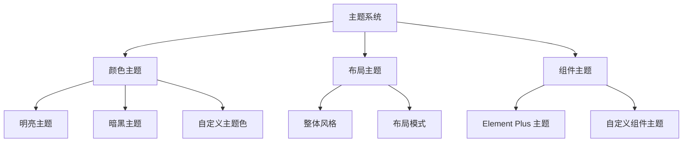

# Layout 设计文档

## 目录

- [概述](#概述)
- [架构设计](#架构设计)
- [布局模式](#布局模式)
- [组件模块](#组件模块)
- [状态管理](#状态管理)
- [响应式设计](#响应式设计)
- [主题系统](#主题系统)
- [扩展指南](#扩展指南)

## 概述

Layout 模块是一个高度模块化、可配置的后台管理系统布局解决方案。基于 Vue 3 + TypeScript + Element Plus 技术栈，提供了完整的布局管理、主题切换、响应式适配等功能。

### 核心特性

- 🎨 **多布局模式**：支持垂直、水平、混合三种布局模式
- 📱 **响应式设计**：完美适配桌面端和移动端
- 🎪 **主题系统**：支持明暗主题切换和自定义主题色
- 🔧 **高度可配置**：丰富的配置选项和实时预览
- 🚀 **性能优化**：路由级别的组件缓存和懒加载
- 🎯 **用户体验**：流畅的动画过渡和交互反馈

## 架构设计

### 目录结构

```
src/layout/
├── components/              # 布局组件集合
│   ├── lay-content/        # 主体内容区
│   ├── lay-footer/         # 页脚组件
│   ├── lay-frame/          # 框架组件
│   ├── lay-navbar/         # 顶部导航栏
│   ├── lay-notice/         # 消息通知
│   ├── lay-panel/          # 设置面板
│   ├── lay-search/         # 全局搜索
│   ├── lay-setting/        # 系统设置
│   ├── lay-sidebar/        # 侧边栏导航
│   └── lay-tag/           # 标签页管理
├── hooks/                  # 组合式函数
│   ├── useBoolean.ts      # 布尔状态管理
│   ├── useDataThemeChange.ts # 主题切换
│   ├── useLayout.ts       # 布局配置
│   ├── useMultiFrame.ts   # 多框架支持
│   ├── useNav.ts          # 导航逻辑
│   └── useTag.ts          # 标签页逻辑
├── index.vue              # 主布局组件
├── frame.vue              # 框架页面
├── redirect.vue           # 重定向组件
└── types.ts              # 类型定义
```

### 组件层次结构



## 布局模式

### 1. 垂直布局 (Vertical Layout)

**特点：**

- 侧边栏位于左侧，包含Logo和导航菜单
- 顶部导航栏包含面包屑、搜索、通知、用户菜单
- 适合传统后台管理系统

**结构：**

```
┌─────────────┬─────────────────────────────────┐
│             │        Header + Tags            │
│   Sidebar   ├─────────────────────────────────┤
│             │                                 │
│             │          Content               │
│             │                                 │
└─────────────┴─────────────────────────────────┘
```

**配置：**

```typescript
$storage.layout = {
  layout: "vertical"
  // ... 其他配置
};
```

### 2. 水平布局 (Horizontal Layout)

**特点：**

- 顶部包含Logo和水平导航菜单
- 内容区占据全部宽度
- 适合菜单层级较少的系统

**结构：**

```
┌─────────────────────────────────────────────┐
│            Header + Navigation              │
├─────────────────────────────────────────────┤
│                                             │
│               Content                       │
│                                             │
└─────────────────────────────────────────────┘
```

### 3. 混合布局 (Mix Layout)

**特点：**

- 结合垂直和水平布局的优点
- 顶级菜单在顶部，子菜单在侧边栏
- 适合菜单层级复杂的大型系统

**结构：**

```
┌─────────────────────────────────────────────┐
│            Top Level Navigation             │
├─────────────┬─────────────────────────────────┤
│             │            Header              │
│  Sub Menu   ├─────────────────────────────────┤
│             │                                 │
│             │           Content              │
│             │                                 │
└─────────────┴─────────────────────────────────┘
```

## 组件模块

### 1. 主布局组件 (index.vue)

**功能：**

- 布局模式切换
- 响应式适配
- 移动端遮罩处理
- 组件协调管理

**核心代码：**

```vue
<template>
  <div ref="appWrapperRef" :class="['app-wrapper', set.classes]">
    <!-- 移动端遮罩 -->
    <div v-show="移动端遮罩条件" class="app-mask" @click="toggleSideBar" />

    <!-- 侧边栏 -->
    <NavVertical v-show="显示侧边栏条件" />

    <!-- 主容器 -->
    <div class="main-container">
      <!-- 内容区 -->
    </div>

    <!-- 设置面板 -->
    <LaySetting />
  </div>
</template>
```

### 2. 导航栏组件 (lay-navbar)

**功能模块：**

| 模块     | 功能          | 组件              |
| -------- | ------------- | ----------------- |
| 面包屑   | 路径导航      | SidebarBreadCrumb |
| 搜索     | 全局菜单搜索  | LaySearch         |
| 全屏     | 页面全屏切换  | SidebarFullScreen |
| 通知     | 消息通知中心  | LayNotice         |
| 用户菜单 | 用户信息&退出 | el-dropdown       |
| 设置     | 打开设置面板  | Setting 图标      |

**响应式特性：**

```typescript
// 移动端显示汉堡菜单
<LaySidebarTopCollapse v-if="device === 'mobile'" />

// 桌面端显示面包屑
<LaySidebarBreadCrumb v-if="layout !== 'mix' && device !== 'mobile'" />
```

### 3. 侧边栏组件 (lay-sidebar)

**子组件结构：**

- `SidebarLogo.vue` - Logo展示
- `SidebarItem.vue` - 菜单项渲染
- `SidebarCollapse.vue` - 折叠控制
- `NavVertical.vue` - 垂直导航
- `NavHorizontal.vue` - 水平导航
- `NavMix.vue` - 混合导航

**动态菜单处理：**

```typescript
const menuData = computed(() => {
  return pureApp.layout === "mix" && device.value !== "mobile"
    ? subMenuData.value // 混合布局显示子菜单
    : usePermissionStoreHook().wholeMenus; // 完整菜单
});
```

### 4. 内容区组件 (lay-content)

**核心功能：**

- 路由视图渲染
- 页面缓存管理
- 动画过渡效果
- 框架页面支持

**页面缓存机制：**

```vue
<keep-alive
  v-if="isKeepAlive"
  :include="usePermissionStoreHook().cachePageList"
>
  <component :is="Comp" :key="fullPath" />
</keep-alive>
```

**动画过渡：**

```typescript
const transitionName = transitions.value(route)?.name || "fade-transform";
const enterTransition = transitions.value(route)?.enterTransition;
const leaveTransition = transitions.value(route)?.leaveTransition;
```

### 5. 标签页组件 (lay-tag)

**功能特性：**

- 多标签页管理
- 右键菜单操作
- 标签页持久化
- 智能/卡片显示模式

**右键菜单选项：**

```typescript
const tagsViews = reactive([
  { icon: RefreshRight, text: "重新加载" },
  { icon: Close, text: "关闭当前标签页" },
  { icon: CloseLeftTags, text: "关闭左侧标签页" },
  { icon: CloseRightTags, text: "关闭右侧标签页" },
  { icon: CloseOtherTags, text: "关闭其他标签页" },
  { icon: CloseAllTags, text: "关闭全部标签页" },
  { icon: Fullscreen, text: "内容区全屏" }
]);
```

### 6. 设置面板组件 (lay-setting)

**配置项分类：**

#### 布局配置

- 布局模式选择（垂直/水平/混合）
- 侧边栏展开/折叠
- 头部固定/浮动
- 页脚显示/隐藏

#### 主题配置

- 明暗主题切换
- 主题色自定义
- 整体风格（跟随系统/明亮/暗黑）
- Element Plus 主题色

#### 功能配置

- Logo 显示/隐藏
- 标签页显示/隐藏
- 标签页持久化
- 灰色模式
- 色弱模式
- 内容区拉伸

## 状态管理

### 1. 布局状态 (useLayout)

**存储结构：**

```typescript
interface LayoutConfig {
  layout: "vertical" | "horizontal" | "mix";
  theme: "light" | "dark";
  darkMode: boolean;
  sidebarStatus: boolean;
  epThemeColor: string;
  themeColor: string;
  overallStyle: "light" | "dark" | "system";
}
```

**初始化逻辑：**

```typescript
const initStorage = () => {
  if (!$storage.layout) {
    $storage.layout = {
      layout: $config?.Layout ?? "vertical",
      theme: $config?.Theme ?? "light"
      // ... 其他默认配置
    };
  }
};
```

### 2. 导航状态 (useNav)

**核心功能：**

- 用户信息管理
- 设备类型检测
- 侧边栏控制
- 全屏切换
- 退出登录

**用户头像处理：**

```typescript
const userAvatar = computed(() => {
  return isAllEmpty(useUserStoreHook()?.avatar)
    ? Avatar // 默认头像
    : useUserStoreHook()?.avatar;
});
```

### 3. 标签页状态 (useTag)

**状态管理：**

- 标签页列表
- 当前激活标签
- 右键菜单状态
- 滚动位置

**操作方法：**

- 添加标签页
- 关闭标签页
- 刷新标签页
- 标签页排序

## 响应式设计

### 1. 断点设计

| 设备类型 | 屏幕宽度       | 布局特点                 |
| -------- | -------------- | ------------------------ |
| 移动端   | < 768px        | 隐藏侧边栏，显示汉堡菜单 |
| 平板端   | 768px - 1024px | 自适应侧边栏宽度         |
| 桌面端   | > 1024px       | 完整布局展示             |

### 2. 响应式处理

**设备检测：**

```typescript
const device = computed(() => {
  return pureApp.getDevice; // "mobile" | "desktop"
});
```

**条件渲染：**

```vue
<!-- 移动端显示 -->
<LaySidebarTopCollapse v-if="device === 'mobile'" />

<!-- 桌面端显示 -->
<LaySidebarBreadCrumb v-if="device !== 'mobile'" />
```

**移动端适配：**

```vue
<!-- 移动端遮罩层 -->
<div
  v-show="device === 'mobile' && sidebar.opened"
  class="app-mask"
  @click="toggleSideBar"
/>
```

### 3. 样式适配

**CSS 媒体查询：**

```scss
.sidebar-container {
  @media (max-width: 768px) {
    position: fixed;
    z-index: 1001;
  }
}
```

**动态类名：**

```vue
:class="[ 'app-wrapper', { 'mobile': device === 'mobile', 'openSidebar':
sidebar.opened, 'withoutAnimation': sidebar.withoutAnimation } ]"
```

## 主题系统

### 1. 主题架构



### 2. 主题切换机制

**主题检测：**

```typescript
const mediaQueryList = window.matchMedia("(prefers-color-scheme: dark)");

function updateTheme() {
  if (overallStyle.value !== "system") return;
  if (mediaQueryList.matches) {
    dataTheme.value = true; // 暗黑主题
  } else {
    dataTheme.value = false; // 明亮主题
  }
  dataThemeChange(overallStyle.value);
}
```

**主题应用：**

```typescript
function dataThemeChange(overallStyle?: string) {
  // 应用主题到 document
  document.documentElement.setAttribute("data-theme", theme);

  // 更新 Element Plus 主题
  document.documentElement.style.setProperty("--el-color-primary", color);
}
```

### 3. 主题配置

**预设主题色：**

```typescript
const themeColors = [
  { color: "#1677FF", themeColor: "blue" },
  { color: "#722ED1", themeColor: "purple" },
  { color: "#13C2C2", themeColor: "cyan" },
  { color: "#52C41A", themeColor: "green" },
  { color: "#FA8C16", themeColor: "orange" },
  { color: "#F5222D", themeColor: "red" }
];
```

**主题持久化：**

```typescript
// 保存到本地存储
$storage.layout = {
  theme: currentTheme,
  epThemeColor: selectedColor,
  overallStyle: style
};
```

## 扩展指南

### 1. 添加新的布局模式

**步骤一：定义布局类型**

```typescript
// types.ts
export type LayoutType = "vertical" | "horizontal" | "mix" | "custom";
```

**步骤二：创建布局组件**

```vue
<!-- NavCustom.vue -->
<template>
  <div class="custom-layout">
    <!-- 自定义布局结构 -->
  </div>
</template>
```

**步骤三：在主布局中注册**

```vue
<!-- index.vue -->
<NavCustom v-show="layout === 'custom'" />
```

### 2. 添加新的导航栏功能

**步骤一：创建功能组件**

```vue
<!-- LayCustomFeature.vue -->
<template>
  <div class="custom-feature">
    <!-- 功能实现 -->
  </div>
</template>
```

**步骤二：在导航栏中引用**

```vue
<!-- lay-navbar/index.vue -->
<LayCustomFeature />
```

### 3. 扩展设置面板

**添加新配置项：**

```vue
<!-- lay-setting/index.vue -->
<li>
  <span>新功能开关</span>
  <el-switch
    v-model="newFeature"
    @change="handleNewFeatureChange"
  />
</li>
```

**配置项持久化：**

```typescript
function handleNewFeatureChange(value: boolean) {
  $storage.configure.newFeature = value;
  // 应用配置变更
}
```

### 4. 自定义主题

**添加新主题色：**

```typescript
const customThemeColors = [
  ...themeColors,
  { color: "#FF6B6B", themeColor: "custom-red" },
  { color: "#4ECDC4", themeColor: "custom-teal" }
];
```

**自定义 CSS 变量：**

```scss
:root[data-theme="custom"] {
  --custom-primary-color: #your-color;
  --custom-bg-color: #your-bg-color;
}
```

## 最佳实践

### 1. 性能优化

**组件懒加载：**

```typescript
const LaySetting = defineAsyncComponent(
  () => import("./components/lay-setting/index.vue")
);
```

**路由缓存：**

```typescript
// 配置需要缓存的路由
const cachePageList = computed(() => {
  return usePermissionStoreHook().cachePageList;
});
```

### 2. 代码组织

**组合式函数封装：**

```typescript
// hooks/useCustomFeature.ts
export function useCustomFeature() {
  const state = ref(false);

  const toggle = () => {
    state.value = !state.value;
  };

  return {
    state,
    toggle
  };
}
```

**类型定义：**

```typescript
// types.ts
export interface CustomConfig {
  enabled: boolean;
  options: string[];
}
```

### 3. 用户体验

**过渡动画：**

```scss
.fade-transform-enter-active,
.fade-transform-leave-active {
  transition: all 0.5s;
}

.fade-transform-enter-from {
  opacity: 0;
  transform: translateX(-30px);
}
```

**加载状态：**

```vue
<div v-loading="loading" element-loading-text="加载中...">
  <!-- 内容 -->
</div>
```

## 总结

Layout 模块通过模块化设计、响应式适配、丰富的配置选项和完善的主题系统，为开发者提供了一个功能完整、易于扩展的后台管理系统布局解决方案。

**核心优势：**

- 🎯 **开箱即用**：完整的功能模块，快速搭建后台系统
- 🔧 **高度可配置**：丰富的配置选项满足不同需求
- 📱 **响应式友好**：完美适配各种设备屏幕
- 🎨 **主题丰富**：支持多种主题和自定义配置
- 🚀 **性能优秀**：懒加载、缓存等优化措施
- 🔌 **易于扩展**：模块化架构便于功能扩展

通过合理使用这些功能和遵循最佳实践，开发者可以快速构建出专业、美观、用户体验良好的后台管理系统。
